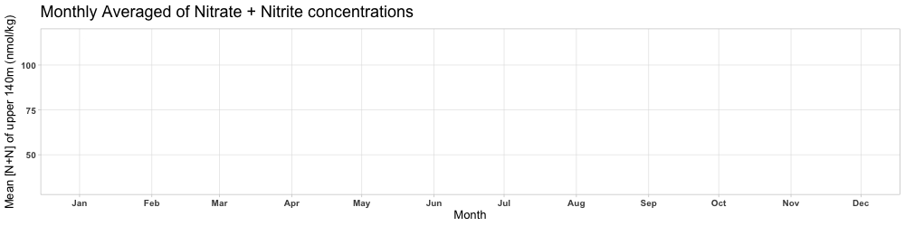
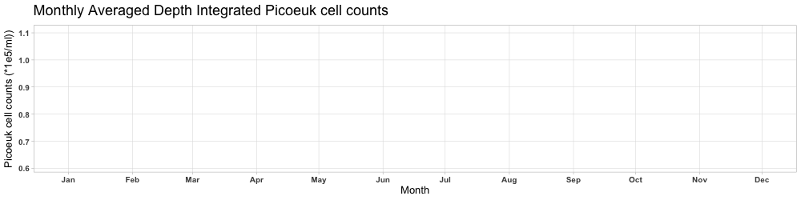

<br>

## Description:

In this document, we will be providing code and comments on the making
of a **HOT plot** (good plot) and a **not so HOT plot** (bad plot). Both
plots are using 20 years worth of low level nitrogen concentration data
and picoeukayrote FCM data collected by the Hawaii Ocean Time-series
(HOT) from Station ALOHA.

Prior to plotting this data will be processed to averaged
depth-integrated data from depths 0-175m for each month at Station
ALOHA.

```{r}

knitr::opts_chunk$set(# set chunk options
  echo = TRUE,         # show code
  message = FALSE,     #dont show messages
  warning = FALSE)    #dont include warnings

```

## Libraries

Here are the libraries being used today:

```{r}

# libraries #

library(here)
library(readxl)
library(pracma)
library(magick)
library(plotrix)
library(tidyverse)
library(patchwork)
library(lubridate)
library(gganimate)
library(wesanderson)

```

## Data

Our data was acquired via the [Hawaii Ocean Timeseries
website](https://hahana.soest.hawaii.edu/hot/hot-dogs/interface.html).

Let us read in the CSV file containing the raw data of Nitrate+Nitrite
concentrations, Picoeukaryote cell counts and dates...

```{r}
# load data #
 
raw_data <- read_excel("../data/raw_data.xlsx") 

# this data was acquired via the Hawaii Ocean Timeseries website


# view #

head(raw_data)
```

<br>

### Data manipulation

<br>

#### Step 1.

Replace the missing values labeled '-9' with NA,

```{r}

# STEP 1 #

# the values'-9' are indicating missing data, these will be replaced with NAs for picoeuk column and n+n column

picoeuk_nutrient <- raw_data %>% 
  mutate(
    `Picoeukaryote cell counts (*1e5/ml)` = na_if(`Picoeukaryote cell counts (*1e5/ml)`, -9),
    `N+N (nmol/kg)` = na_if(`N+N (nmol/kg)`, -9)
  )

  # if value in this row is "-0" then identify as NA.


# view again #
head(picoeuk_nutrient)

```

<br>

#### Step 2.

Convert the date column to *Date* format, make a column for **year and
month**, then filter for pressure samples only taken within the
pressure/depths of 0-140m and then rounding all the depths to the
nearest 5m for simplification in viewing the data.

```{r}

# STEP 2 #

# we are going to make an updated dataframe that uses lubridate and converts 'date (mmddyy)' to date format and extract the year and month

picoeuk_nutrient <- picoeuk_nutrient %>%
  mutate(`Date (mmddyy)` = sprintf("%06d", as.numeric(`Date (mmddyy)`)), 
         # convert to numeric and make sure to account for lack of leading zeros
         Date = as.Date(`Date (mmddyy)`, format = "%m%d%y"),
         #lubridate convert using as.Date
         YearMonth = format(Date, "%Y-%m"))  %>%
  #extract the year and month
  filter(`Pressure (dbar)` >= 0 & `Pressure (dbar)` <= 140) %>%
  mutate(`Pressure (dbar)` = round(`Pressure (dbar)` / 5) * 5)
#filter for pressure samples only taken within the pressure/depths of 0-140m

# display #
head(picoeuk_nutrient)
```

<br>

#### Step 3.

Find the integral of Picoeuk cell counts and Mean [Nitrate+Nitrite] of
each date

Use *picoeuk_nutrient* data to Average some of this data has data taken
multiple times a day, we will average N+N by date and pressure to get a
data set with the most accurate concentration by depth for that given
day. Then we will use the trapz() function in Pracma to get the depth
integrated picoeuk cell counts.

```{r}

# STEP 3 #

# Some of this data has data taken multiple times a day, A) we will find the average N+N and picoeuk cell counts by date and pressure to get a data set with the most accurate concentration by depth for that given day. B) Then we will use the averaged picoeuk cell count data to find the depth integrated (0-140m) values per date ('picoeuk_integral_daily') and will rename the N+N mean per date column to 'N_N_mean_daily'

##### Step 3A: Aggregate by Date and Pressure (calculate means for depth and day and account for NAs)
  
# Combined aggregation and integration pipeline
integral_mean_daily <- picoeuk_nutrient %>%
  group_by(Date, `Pressure (dbar)`) %>% # group by pressure and Date
  summarise(
    `N+N (nmol/kg)` = ifelse( 
      #check for NA and return NA if all are NA, no change in name
      all(is.na(`N+N (nmol/kg)`)), NA, mean(`N+N (nmol/kg)`, na.rm = TRUE) 
      #ignore NA during calcs
    ),
    `Picoeukaryote cell counts (*1e5/ml)` = ifelse( 
      #check for NA and return NA if all are NA, no change in name
      all(is.na(`Picoeukaryote cell counts (*1e5/ml)`)), NA, 
      mean(`Picoeukaryote cell counts (*1e5/ml)`, na.rm = TRUE) 
      #ignore NA during calcs
    ),
    .groups = 'drop'  # ungroup after calculations have been made
  ) %>%
  
##### Step 3B: integration by date and rename mean for [N+N] column ####
  
  group_by(Date) %>% #group by Date
  summarise(
    N_N_mean_daily = mean(`N+N (nmol/kg)`, na.rm = TRUE),  
    # daily mean of N+N values determined via summerise(mean())
    picoeuk_integral_daily = trapz(
      x = `Pressure (dbar)`, 
      y = replace_na(`Picoeukaryote cell counts (*1e5/ml)`, 0)
    ),
    #depth integrated (0-140m) picoeukaryote cell counts
    .groups = 'drop'  # Ungroup after summarizing
  )

# display #
head(integral_mean_daily)


```

<br>

#### Step 4.

Determine monthly averaged depth integrated picoeuk cell count and
[Nitrate+Nitrite]

Final step. We now just need a monthly average derived from our last
step where we determined the date average values for [N+N] across all
depths and depth integrated picoeuk cell counts.

```{r}

### STEP 4 ###

# Final step. We now just need a monthly average derived from our last step where we determined the date average values for [N+N] across all depths and depth integrated picoeuk cell counts.

#give new name for our final product dataset

monthly_average_integral <- integral_mean_daily %>%
  mutate(Month = month(Date)) %>% # make new column with...
  mutate(Month = factor(month.abb[Month], levels = month.abb)) %>% #abbreviated months names
  group_by(Month) %>% #group by month when finding the mean and SDs
  summarise(
    Monthly_N_N_mean = mean(N_N_mean_daily, na.rm = TRUE),
    Monthly_N_N_sd = sd(N_N_mean_daily, na.rm = TRUE),  # Calculate SD for N_N_integral
    Monthly_Picoeuk_integral = mean(picoeuk_integral_daily, na.rm = TRUE),
    Monthly_Picoeuk_sd = sd(picoeuk_integral_daily, na.rm = TRUE),  # Calculate SD for Picoeuk_integral
    .groups = 'drop' #ungroup them
  )

# display #
head(monthly_average_integral)

```

<br>

Yikes, those standard deviation values are horrendous! We will of course
be responsible here and display them in our graphs later down the road.
Regardless, we are too deep in this to turn around and will commit to
using this very *uncertain* dataset!

<br>

## Good Plot assemblage

<br>

### plot_NN

Timeseries of Nitrate+Nitrite monthly averaged concentrations in the
euphotic zone Samples measurements that were averaged monthly were
acquired from depths ranging from 0-140m taken numerous times throughout
the last 20 years then averaged by month.

```{r}
#plot_NN: Monthly averaged upper 140m NN conc. using ggplot geom_lines

plot_NN <- ggplot(monthly_average_integral, aes(x = Month)) +# month on x axis
  geom_line(aes(y = Monthly_N_N_mean, group = 1, color = "N+N (nmol/kg)"), size = 1) +
  geom_errorbar(aes(                                        # error bars added 
    ymin = Monthly_N_N_mean - Monthly_N_N_sd,
    ymax = Monthly_N_N_mean + Monthly_N_N_sd
  ), width = 0.2, color = wes_palette("AsteroidCity1")[1], alpha = 0.5) +
  #appealing colors and readable
  scale_y_continuous(name = "Mean N+N (nmol/kg)") + #name y axis
  scale_color_manual(
    name = "Legend",
    values = c("N+N (nmol/kg)" = wes_palette("AsteroidCity2")[3])
  ) +
  labs( #labels
    title = "Monthly Averaged Picoeukaryote Cell Counts and [Nitrate + Nitrite]",
    x = "",
    y = "Mean N+N (nmol/kg)"
  ) +
  theme_light() + # not distracting theme, readable
  theme( #adjust title aesthetics and remove legend
    plot.title = element_text(face = "bold", size = 13), # adjust plot title aesthetics
    axis.title.y = element_text(size = 8, face = "bold"),# adjust aestheticss
    axis.text.y = element_text(size = 8),
    axis.text.x = element_text(angle = 45, hjust = 1),# adjust angle for readability
    legend.position = "none" #unnecessary
  )

```

<br>

### plot_picoeuk

Timeseries of depth integrated (0-140m) picoeukaryote cell counts
monthly averaged. Samples measurements that were averaged monthly were
acquired from depths ranging from 0-140m taken numerous times throughout
the last 20 years then averaged by month.

```{r}

# plot_picoeuk: Monthly averaged upper 140m depth integrated picoeukaryote cell counts using ggplot geom_lines

monthly_average_integral$MonthDate <- as.Date(paste0("2020-", monthly_average_integral$Month, "-1"), format = "%Y-%b-%d")

#reading month as a Date formatted value using "%Y-%b-%d" specifically, then the value being just the abbreviated version of the month

#geom_lines from ggplot

plot_picoeuk <- ggplot(monthly_average_integral, aes(x = Month)) + # month on x axis
  geom_line(aes(y = Monthly_Picoeuk_integral, color = "Picoeukaryote cell counts"), group = 1, size = 1) +# error bars added 
  geom_errorbar(aes(ymin = (Monthly_Picoeuk_integral) - (Monthly_Picoeuk_sd),
                    ymax = (Monthly_Picoeuk_integral) + (Monthly_Picoeuk_sd)),
                width = 0.2, color = wes_palette("AsteroidCity1")[2], alpha = 0.7) + 
  #pretty colors but not distracting
  scale_y_continuous(
    name = "Picoeuk cell counts (*1e5/ml)") +
  scale_color_manual( #manual colors
    name = "Legend",
    values = c("Picoeukaryote cell counts" = wes_palette("AsteroidCity2")[4])) +
  #pretty colors but not distracting
  labs(title = #labels
         "",
       x = "Month", # month as x axis label
       y = "Picoeukaryote depth integrated counts (*1e5/ml)") +# y axis label
  theme_light() + # not distracting theme, readable
  theme( # adjust boldness and size for cleaner look
    plot.title = element_text(face = "bold"),
    axis.title.y = element_text(size = 8, face = "bold"),
    axis.title.x = element_text(size= 8, face = "bold"),
    axis.text.y = element_text(size = 8), 
    axis.text.x = element_text(angle = 45, hjust = 1),
    legend.position = "none" #unnecessary
  )

```

<br>

Combine the plots into one! Having them side by side will highlight this
possible correlation between nitrate + nitrite concentrations and cell
counts of picoeukaryotes

## Good plot:

```{r}

#combine the plots (stack them) from patchwork 

good_plot <- plot_NN / plot_picoeuk


# display #
good_plot
```

**Figure 1.** Picoeukaryote cell counts were depth integrated from
0-140m. The average value by month was taken and used in the line plot
(bottom plot). The N+N data is displaying the mean concentration for
samples collected within 0-140m then averaged by month.

<br>

### Is this even a good plot?

I know, those big error bars hurt my eyes as well but it did provide me
the opportunity to be transparent with my data, which is a responsible
characteristic of this plot. In terms of its appearance, it is not
cluttered and very easy to read. There is no legend or any other
unnecessary information, yet I have included the necessary labels and
details such as detailed axes labels, tick marks and a figure caption.
If you squint hard enough you can see some areas where a rise in
Picoeukaryote cells follows an increase in N+N concentrations.

<br>

### Animate the Good Plot

Since it is after all a time series, an animation revealing the
progression of these coupled measurements with time seems fitting.

Using gganimate and the code we used for the plots, we will do a
transition reveal using the month data to show progression of the values
over time.

<br>

```{r}

#ANIMATION FOR N+N PLOT

animation_plot_NN<-ggplot(monthly_average_integral, aes(x = MonthDate, y = Monthly_N_N_mean)) +
  geom_line(color = wes_palette("AsteroidCity2")[3], size = 1.2) +
  scale_x_date(date_labels = "%b", date_breaks = "1 month") +
  labs(title = "Monthly Averaged of Nitrate + Nitrite concentrations", x = "Month", y = "Mean [N+N] of upper 140m (nmol/kg)") +
  theme_light()+ #nice on the eyes
  theme( #adjustments for readability
    plot.title = element_text(face = "bold", size = 18),
    axis.text = element_text(face = "bold", size = 10),
    axis.title = element_text(face = "bold", size = 13, margin = margin(t = 30)),
    panel.grid.minor = element_blank() ) + #get rid of ugly minor lines
  transition_reveal(MonthDate) 

# Save the animation as a GIF
#anim_save("animation_plot_NN.gif", animation = animate(animation_plot_NN, fps = 10, nframes = 150, width = 1000, height = 250))


```

<br>

```{r}

#SAME ANIMATION BUT FOR PICOEUK PLOT

animation_plot_pico<-ggplot(monthly_average_integral, aes(x = MonthDate, y = Monthly_Picoeuk_integral)) +
  geom_line(color = wes_palette("AsteroidCity2")[4], size = 1.2) +
  scale_x_date(date_labels = "%b", date_breaks = "1 month") +
  labs(title = "Monthly Averaged Depth Integrated Picoeuk cell counts", x = "Month", y = "Picoeuk cell counts (*1e5/ml))") +
  theme_light()+
  theme(
    plot.title = element_text(face = "bold", size = 18),
    axis.text = element_text(face = "bold", size = 10),
    axis.title = element_text(face = "bold", size = 13, margin = margin(t = 30)),
    panel.grid.minor = element_blank() ) + #get rid of ugly minor lines
  transition_reveal(MonthDate) 

# Save the animation as a GIF
#anim_save("animation_plot_pico.gif", animation = animate(animation_plot_pico, fps = 10, nframes = 150, width = 1000, height = 250))

```

<br>

### Good Plot Timeseries Animation:





<br>

## Bad Plot assemblage

**Let's make something that is incredibly hard to interpret, distracting
yet painful on the eyes, and very misleading.**

First we'll need to falsely prepare the data. In making this bad plot, I
thought a confusing way to display the relative proportions of these
values would be to combine two measurements onto a single pie chart. So
the final product will have a pie chart with the relative proportion of
the N+N conc. and picoeuk cell counts for each month.

```{r}

# prep data for the pie chart, we'll need to combine these values in such a way 
#that we can present both measurements on a pie graph. using these pico_values 
#and nn_values to find the relative proportion of the N+N conc. and picoeuk cell counts for each month

pico_values <- as.numeric(monthly_average_integral$Monthly_Picoeuk_integral)
nn_values <- as.numeric(monthly_average_integral$Monthly_N_N_mean)

# combine data into a single data frame suitable for a a pie chart: 
#making a new data frame with these measurements combined. 
#We are pivoting long but without using the pivot_longer function

combined_data <- data.frame( 
    Category = rep(c("Picoeukaryote", "N+N"), each = 12), 
    #combining the measurments that have 12 values each
    Month = rep(monthly_average_integral$Month, 2),
    Value = c(pico_values, nn_values)
)
```

<br>

**Code for pie chart using ggplot geom_bar in combination with
coord_polar:**

```{r}

# plot the pie chart using ggplot

pie_chart <- ggplot(combined_data, aes(x = "", y = Value, 
                                       fill = interaction(Category, Month))) + 
  # the fill is determined by the month AND the category/measurment
    geom_bar(stat = "identity", position = "stack", width = 1) + 
  # piegraph component one
    coord_polar(theta = "y", start = 0) +
  # piegraph component two
    scale_fill_manual(values = rep(c("#FF6347", "#ADFF2F", "#1E90FF", "#FFD700", "#FF00FF", 
                                     "#00CED1", "#FF4500", "#DA70D6", "#32CD32", "#87CEEB",
                                     "#8A2BE2", "#D2691E"), 2)) +
  
  # *incredibly painful colors. warning*
  
    theme_void() + # this will make the pink and the pink background clash nicely
    theme( #legend addition and font adjustments...muahahaha
        legend.position = "right", # extremely extensive legend with 24 boxes!
        plot.background = element_rect(fill = "#FF00FF"), 
        # disgusting color for background
        text = element_text(family = "Papyrus", size = 12) #very hard to read font
    ) +
    labs( #labels
        title = "Monthly proportions of N+N and Picoeukaryote cell counts",
        fill = "Measurment.Month"
    )

# Save the ggplot chart to a file in the 'output' directory
ggsave(
  filename = here("Week_09", "images", "temp_pie_chart.png"), 
  plot = pie_chart, 
  width = 10, 
  height = 8
)
```

<br>

**OH but we're not done yet...**

<br>

We have some *aesthetic additions* needing to be made. We will now add
some irrelevant images Homer Simpson photos to the plot using Magick
package to make it distracting in an unnecessary manner.

<br>

```{r}
# load the pie chart image made earlier #
piechart_plot <- image_read("../images/temp_pie_chart.png")

# load the Homer image downloaded online #
homer_pie <- image_read("../images/homer_image.webp") # Replace with the actual path to the Homer image

# resize the Homer image to make it very small #
homer_pie_small <- image_scale(homer_pie, "300x300")

# combine the pie plot with 4 small Homer images #
badplot <- piechart_plot %>%
    image_composite(homer_pie_small, offset = "+2000+2000") %>%
    image_composite(homer_pie_small, offset = "+50+2000") %>%
    image_composite(homer_pie_small, offset = "+50+180") %>%
    image_composite(homer_pie_small, offset = "+2000+160")

# Save the final output
#image_write(out, path = "../output/bad_plot.png")


```

<br>

## Bad Plot:

```{r, echo=FALSE}
# display #
badplot
```

<br>

### Is this even a Bad Plot?

**Problems with the data:**

The plot fails to provide you with a sense for the monthly proportions
of [N+N] and picoeuk cell counts. By combining the two measurements into
a singular pie chart it becomes impossible to interpret because the
relative proportions are being taken for N+N conc. and picoeuk cell
counts *together*. To be clear, a pie chart is never a great place to
start, but if I wanted to make this a better pie chart to show the
relationship between the measurements and the months, I would have
separated these measurements into two different pie charts using facet
functions.

**Problems with the appearance:**

There are so many things I hate regarding the look of this pie chart...

-   ugly papyrus font used

-   eye blinding colors

-   pink panel background clashing with the pie chart

-   Homer Simpson photos are irrelevant and distracting

-   legend (24 items)

I am sorry for the pain and/or damage that seeing all these disgusting
graphs have caused you!
