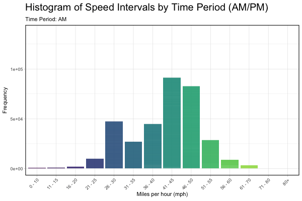

```{r setup, include=FALSE}

knitr::opts_chunk$set(echo = TRUE, message = FALSE, warning = FALSE)

```

<br>

# Description

I am curious as to how these speed intervals all compare. What are the main intervals at which cars travel at and how do they change from AM to PM? We will be making an animated histogram that transitions from AM data PM data of traffic speed intervals using the *National Highway traffic* data from this weeks *Tidy Tuesday*. To do so we will clean the data by selecting the columns we need, creating an AM/PM column using the time column, switching some labels, etc. Then we will use **ggplot** and **gganimate** to construct the animated histogram using our cleaned up data.

<br>

# Libraries and Load Data

```{r}

# library #

library(ggridges)
library(tidyr)
library(dplyr)
library(here)
library(readr)
library(stringr)
library(ggplot2)
library(kableExtra)
library(viridis)
library(gganimate)

```

```{r}

# load data from tidy tuesday traffic data #

raw_traffic <- readr::read_csv('https://raw.githubusercontent.com/rfordatascience/tidytuesday/main/data/2024/2024-12-03/A64_traffic.csv')

# display #
head(raw_traffic)

```

<br>

# Data manipulation

**Clean up the data** We will be taking the **raw_traffic** data, selecting for only 'Time Period Ending', 'Report Date' and speed intervals; assigning time periods (am/pm) to this data - taking into account 0000 and 1200; getting rid of the zeros; pivotting the speed interval long to help with downstream analysis; and making speed interval a factor.

```{r}

# clean up raw data #

# take the **raw_traffic** data, selecting for only 'Time Period Ending', 'Report Date' and speed intervals; assigning time periods (am/pm) to this data - taking into account 0000 and 1200; getting rid of the zeros and making speed interval a factor. 

clean_traffic <- raw_traffic %>%
  select(`Time Period Ending`,`Report Date`, `0 - 10 mph`:`80+ mph`) %>% # select these columns
  mutate(
  Period = case_when( #taking into account 0000 and 1200
    as.numeric(substr(`Time Period Ending`, 1, 2)) == 12 ~ "PM",  # noon
    as.numeric(substr(`Time Period Ending`, 1, 2)) == 0 ~ "AM",   # midnight
    as.numeric(substr(`Time Period Ending`, 1, 2)) < 12 ~ "AM",   # morning
    TRUE ~ "PM"                                                   # afternoon/evening
  )
) %>%
  pivot_longer(cols = `0 - 10 mph`:`80+ mph`, 
# pivot the speed interval and associated frequency data to make histogram synthesis easy
               names_to = "Speed_Interval",
               values_to = "Frequency") %>%
  filter(Frequency > 0) %>% #get rid of zeros
  mutate(Speed_Interval = str_replace_all(Speed_Interval, " mph", "")) %>%  # remove " mph"
  mutate(Speed_Interval = factor(Speed_Interval)) %>%  # ensure it is a factor
drop_na() #drop it 

clean_traffic %>% # make a pretty lil' table
  head(6) %>% 
  kable() 

```

<br>

# Plot

We will now use the **clean_traffic** data to make a histogram that looks at the overall frequency/occurrence of cars driving within that speed interval. We will facet_wrap the Period for this output but will use Period in assigning a transition state.

```{r}

# histogram is made using ggplot and gganime, assign x to speed interval and y to the total frequency. 
#Fill will be assigned to speed interval to compare across the various mph intervals

traffic_histo<- ggplot(clean_traffic, aes(x = Speed_Interval, y = Frequency, fill = Speed_Interval)) +
  geom_bar(stat = "identity", alpha = 0.8) +
  facet_wrap(~ Period) +
  theme_light() +
  labs(
    title = "Histogram of Speed Intervals by Time Period (AM/PM)",
    x = "Miles per hour (mph)",
    y = "Frequency",
    fill = "Speed Interval"
  ) +
  scale_fill_viridis_d(option = "D") +
  theme(
    axis.text.x = element_text(angle = 45, hjust = 1),
    legend.position = "none",  # Remove the legend
    panel.border = element_rect(color = "black", fill = NA, size = 1),
    # add box around each facet
    strip.background = element_rect(color = "black", fill = "lightgray"),  
    # add background to facet labels
    strip.text = element_text(size = 12, face = "bold"),  
    # customize facet label text
    plot.title = element_text(size = 18, face = "bold")
  )

# display #
traffic_histo

```

<br>

# Animate

We will use the same plot structure but assign a transition state (Period) to animate the difference between AM and PM.

```{r}

traffic_histo_animated <- ggplot(clean_traffic, aes(x = Speed_Interval, y = Frequency, fill = Speed_Interval)) +
  geom_bar(stat = "identity", alpha = 0.8) +
  theme_light() +
  labs(
    title = "Histogram of Speed Intervals by Time Period (AM/PM)",
    subtitle = "Time Period: {closest_state}",
    x = "Miles per hour (mph)",
    y = "Frequency",
    fill = "Speed Interval"
  ) +
  scale_fill_viridis_d(option = "D") +
  theme(
    axis.text.x = element_text(angle = 45, hjust = 1),
    legend.position = "none",  # remove the legend
    panel.border = element_rect(color = "black", fill = NA, size = 1),  
    strip.background = element_rect(color = "black", fill = "lightgray"),  
    strip.text = element_text(size = 12, face = "bold"),
    plot.title = element_text(size = 20, face = "bold")
  ) +
  transition_states(Period, transition_length = 6, state_length = 6) +  
  # transition between AM and PM
  enter_fade() +  # fade in
  exit_fade()     # fade out


```



# What did I learn?

I learned *quite* a bit in this Tidy Tuesday. Animations were one of my weaknesses going into this Tidy Tuesday, this was something I wanted to improve on. A histogram animation showing two different phases is a new output I have not taken on before. The first few attempts were very unsuccessful, it was not transitioning soon and the data looked different. I had to specify a few things in the "Time Period" column and then also adjust the **animat()** settings as well as the transition_length and state_length. Pivotting long is not something that I haven't done before but knowing to pivot_long without any outside resources was a big step in growing my R skills. Lastly, I haven't used the viridis color gradient pallete before and am very pleased with the clean and easy to read presentation.
